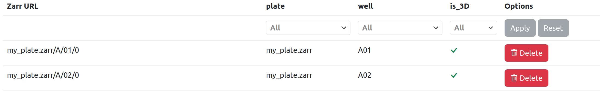
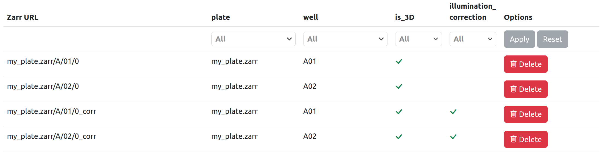
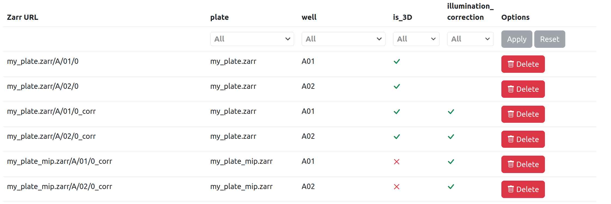

# Image List

While applying a processing workflow to a given dataset, Fractal keeps a list of all the OME-Zarr images it is processing and their metadata. In this page we describe the concepts of [images](#images) and [filters](#filters) - see also the [examples section](#examples).

## Images

Each entry in the image list is defined by a unique `zarr_url` property (the full path to the OME-Zarr image), and it may also include image types and image attributes.

### Image types

Image types are boolean properties that allow to split the image list into different sub-lists (e.g. the `is_3D` type for 3D/2D images, or the `illumination_corrected` type for raw/corrected images when illumination correction was not run in-place). Types can be set both by the task manifest (e.g. after an MIP task, the resulting images always have the type `is_3D` set to `False` - see [task-manifest section](#dataset-filters)) as well as from within an individual task (see [task-API/output section](./tasks_spec.md#output-api)).

Note: when applying filters to the image list, the absence of a type corresponds to false by default.

### Image attributes

Image attributes are scalar properties (strings, integers, floats or booleans). They are always defined from within individual tasks, and never by the task manifest. They allow selecting subsets of your data (e.g. select a given well, a given plate or a given multiplexing acquisition).

Fractal server uses the image list combined with filters (see [below](#dataset-filters)) to provide the right image URLs to tasks.

## Filters

Before running a given task, Fractal prepares an appropriate image list by extracting the images that match with a given set of filters (that is, a set of specific values assigned to image types and/or image attributes). Filters can be defined for a dataset and/or for a workflow task. If a specific filter is set both for the dataset and for the workflow task, the workflow-task filter takes priority.

### Dataset filters

There are multiple ways a dataset may have a given filter set:

1. I manually set it, by modifying the dataset `filters` property.
2. While writing the Fractal manifest for a task package, I include the `output_types` attribute for a given task. These types are automatically included in the dataset filters after the task is run. 
Examples:
    * An MIP task would set `output_types = {"is_3D": False}` in its output arguments: from this task onwards, the 2D images are processed (not the raw 3D images).
    * An illumination-correction task would set `output_types = {"illumination_corrected": True}`: from this task onwards, the registered images are processed (not the raw images).
3. When writing the code for a specific task, the task output can include a `filters` property, for either image attributes and/or types - see the [section on task outputs](./tasks_spec.md#output-api).

Examples:

* My dataset currently has the type filter `{"is_3D": False}`, because I previously ran an MIP task. Subsequent tasks in the workflow will run on 2D images by default.
* My dataset currently has the attribute filter `{"well": "B03"}`, because I manually added it to the dataset (I just want to process a single well for the time being).
* My dataset currently has the attribute filter `{"acquisition": 1}`, because I manually added it to the dataset (I just want to process a single multiplexing acquisition).

### Workflow-task filters

I can manually set an additional input filter by modifying the workflow-task `input_filters` property. 

Examples:

* I may need a workflow that includes the MIP task but then switches back to 3D images in a later task. I can achieve this by setting `input_filters = {"is_3D": True}` for the relevant task, so that from this task onwards the 3D images is processed (and not the 2D ones).

### Additional validation

Task manifest may also specify the `input_types` of a given task. These are not used for filtering the image list, but rather to validate that the filtered image list is valid. If some images of the filtered list do not comply with `input_types`, the Fractal runner raises an error.

Examples:

* The illumination-correction task has `input_types={"illumination_corrected": False}`, which means it cannot run on images with type `illumination_correction=True`.
* The Apply Registration to Image task has `input_types={"registered": False}`, which means it cannot run on images with type `registered=True`.

## Examples

After running a converter task, I may have an OME-Zarr HCS plate with 2 wells that contain one image each. In this case, the image list has 2 entries and each image has attributes for plate and well, as well as a true/fals `is_3D` type.

 If I then run an illumination-correction task that does not overwrite its input images, the image list includes the two original images (without the `illumination_corrected` type) and two new ones (with `illumination_corrected` type set to true). Note that this task also sets the dataset type filters to `{"illumination_correction": True}`.

If I then run an MIP task, this will act on the two images with `illumination_corrected` set to true, due to the dataset filters. After the task has run, two new images are added to the list (with type `is_3D` set to false).

Another example is that if I have an OME-Zarr HCS plate with 3 wells and each well has 3 multiplexing acquisition, then the image list includes 9 OME-Zarr images (and those entries should have the acquisition attribute set).
