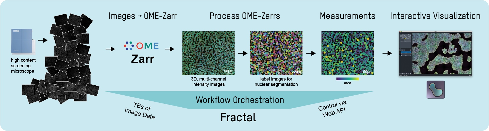

Fractal is a framework to process bioimaging data at scale in the OME-Zarr format and prepare the images for interactive visualization.

Fractal enables distributed workflows that convert TBs of image data into [OME-Zarr](https://ngff.openmicroscopy.org) files. Tasks are modular and can be provided by users to apply image processing and measurements. We provide a pacakge of core processing tasks that can apply illumination correction, maximum intensity projection, 3D segmentation using [cellpose](https://cellpose.readthedocs.io/en/latest/) and measurements using [napari workflows](https://github.com/haesleinhuepf/napari-workflows). All tasks can be orchestrated by Fractal to run locally or on clusters to scale the image analysis. The resulting pyramidal OME-Zarr files enable interactive visualization in different modern viewers like [MoBIE](https://imagej.net/plugins/mobie) and [napari](https://napari.org/stable/). 

<iframe width="560" height="315" src="https://www.youtube-nocookie.com/embed/DfhRF1OW5CE" title="YouTube video player" frameborder="0" allow="accelerometer; autoplay; clipboard-write; encrypted-media; gyroscope; picture-in-picture; web-share" referrerpolicy="strict-origin-when-cross-origin" allowfullscreen></iframe>

 
  
## Fractal components

Fractal is made of different components, including a server/client architecture, a web client and a set of core tasks for image processing.

|  **Component** 	|                                  **GitHub Repository**                                 	|                                      **Documentation**                                     	|                                **Package**                                	|
|:--------------:	|:--------------------------------------------------------------------------------------:	|:------------------------------------------------------------------------------------------:	|:-------------------------------------------------------------------------:	|
|   **server**   	|     [fractal-server](https://github.com/fractal-analytics-platform/fractal-server)     	|     [fractal-server docs](https://fractal-analytics-platform.github.io/fractal-server)     	|     [fractal-server on PyPI](https://pypi.org/project/fractal-server)     	|
|   **client**   	|     [fractal-client](https://github.com/fractal-analytics-platform/fractal-client)      	|       [fractal-client docs](https://fractal-analytics-platform.github.io/fractal-client)      |     [fractal-client on PyPI](https://pypi.org/project/fractal-client)     	|
|  **web client**  	|        [fractal-web](https://github.com/fractal-analytics-platform/fractal-web)          	|        [fractal-web docs](https://fractal-analytics-platform.github.io/fractal-web)           |                                     -                                     	|
| **core tasks** 	| [fractal-tasks-core](https://github.com/fractal-analytics-platform/fractal-tasks-core) 	| [fractal-tasks-core docs](https://fractal-analytics-platform.github.io/fractal-tasks-core) 	| [fractal-tasks-core on PyPI](https://pypi.org/project/fractal-tasks-core) 	|

## Status

Fractal is under active development. We have tasks in our core repository and in multiple other tasks repositories. Our core repository contains a converter for Yokogawa CV7000/CV8000 image data as well as different processing tasks for illumination correction, maximum intensity projection, cellpose segmentation.
We're working with others to expand the number of compatible OME-Zarr converters (see e.g. [fractal-faim-hcs](https://github.com/jluethi/fractal-faim-hcs), which uses the faim-hcs converters for the MD Image Xpress), additional image processing tasks (see e.g. [APx Fractal Task Collection](https://github.com/Apricot-Therapeutics/APx_fractal_task_collection) for tasks centered around 2D image analysis and drug profiling) and additional processing tasks (e.g. the [scMultipleX package](https://github.com/fmi-basel/gliberal-scMultipleX), which contains a Fractal task to make many scikit-image based measurements in 2D and 3D, as well as organoid registration for multiplexed images). Follow along on the github repositories above and feel free to open issues.

## Build your own task
You can easily add your own task to Fractal. Fractal can run Linux executables that follow its task API, as defined in the [task building documentation](https://fractal-analytics-platform.github.io/fractal-tasks-core/custom_task/). We primarily run Python-based tasks. You can find a full walk-through and templates in the [Build Your Own Fractal Task page](https://fractal-analytics-platform.github.io/build_a_fractal_task/).

## Examples

Example datasets and workflows are publicly available:

* Example output data from Fractal in the OME-Zarr format can be found here: [Small dataset: 10.5281/zenodo.10257149](https://doi.org/10.5281/zenodo.10257149), [larger dataset: 10.5281/zenodo.10257532](https://doi.org/10.5281/zenodo.10257532)
* Example input datasets can be found here: [Small Fractal dataset for automated testing & task development](https://zenodo.org/records/8287221), [Larger example input data for Fractal](https://doi.org/10.5281/zenodo.7057076).
* Additional example workflows can be found in the [fractal-demos repository](https://github.com/fractal-analytics-platform/fractal-demos) in the `examples` folder. 

## Contributors and license

Unless otherwise stated in each individual module, all Fractal components are released according to a BSD 3-Clause License, and Copyright is with the BioVisionCenter at the University of Zurich.

Fractal was conceived in the Liberali Lab at the Friedrich Miescher Institute for Biomedical Research and in the Pelkmans Lab at the University of Zurich by [@jluethi](https://github.com/jluethi) and [@gusqgm](https://github.com/gusqgm). The Fractal project is now developed at the BioVisionCenter at the University of Zurich and the project lead is with [@jluethi](https://github.com/jluethi). The core development is done under contract by [eXact lab S.r.l.](https://www.exact-lab.it).
