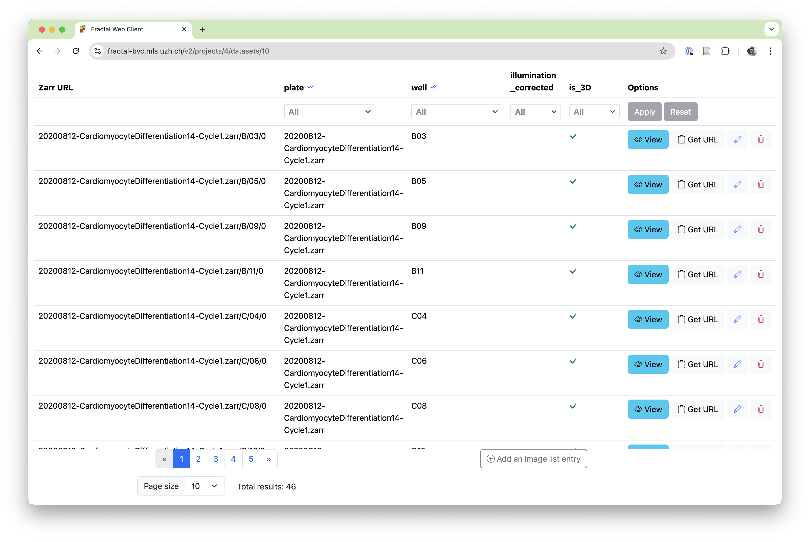
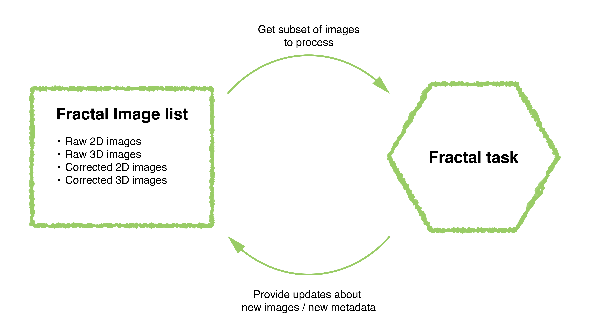
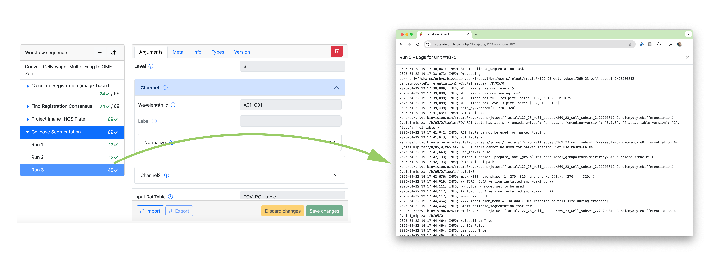
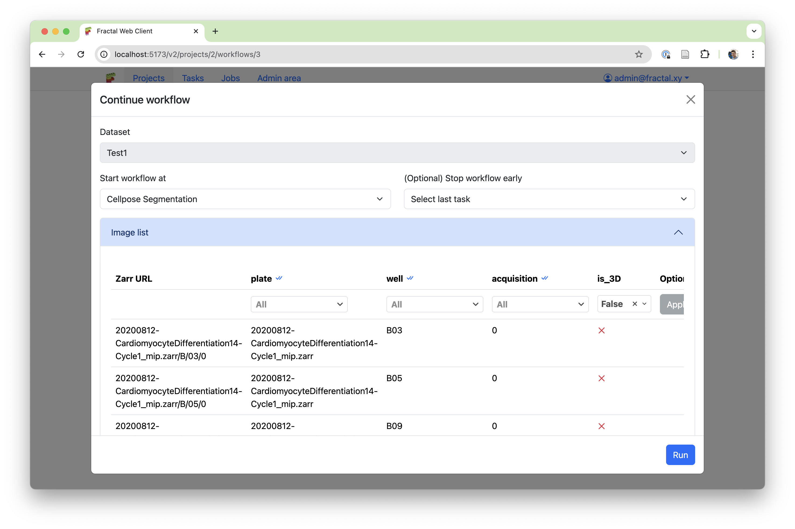
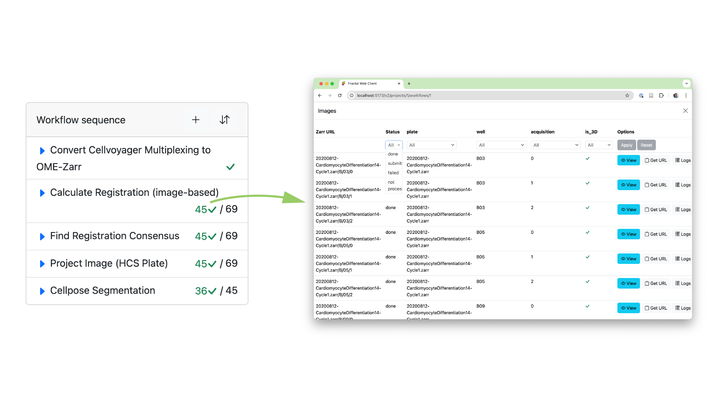

# Fractal flexibility

The [Fractal framework](../index.md), developed at the [BioVisionCenter](https://www.biovisioncenter.uzh.ch/en.html), allows users to build complex image processing workflows and run them on Terabytes of high-dimensional microscopy data. 

As our user base has grown over last year, so has the need to test workflows on small subsets of data and trace exactly where issues occur. For this purpose, we’ve invested a lot of our work over the past months in what we call the “Fractal flexibility project”. 

The Fractal server 2.14 update enables more flexible filtering in workflows, allows new modes of submitting workflows in parts and monitoring their progress more dynamically, and improves our underlying history data structure to ensure we keep track of granular processing steps. This post explains how filters & history work in the Fractal framework and what new modes the recent Fractal updates have enabled for running more interactive workflows.

<iframe width="560" height="315" src="https://www.youtube.com/embed/Jdr7VOiv7k0?si=szXxmaOQyP3r0mj0" title="YouTube video player" frameborder="0" allow="accelerometer; autoplay; clipboard-write; encrypted-media; gyroscope; picture-in-picture; web-share" referrerpolicy="strict-origin-when-cross-origin" allowfullscreen></iframe>

## Flexible filters in the Fractal framework

When processing OME-Zarrs with Fractal, the framework **keeps track of all the images imported or created in the [image list](../image_list.md)**. These images contain metadata about the type of images (e.g., are they 2D or 3D images, were they processed by an illumination correction or registration task, etc.), as well as attributes that describe how the image fits into the larger collection. In a high content screening context, that often means which plate and well the image belongs to, or whether it is one of multiple image acquisitions.

In Fractal workflows, every task gets a filtered selection of the image list to process and can provide updates to this image list, be they new images that get added or changes to the attributes and types of existing entries. The image list keeps track of all the available images, while each task gets a precise selection of images to process. 

Using type filters allows splitting datasets into different sub-lists. This allows the design of complex workflows, for instance converting 3D data to an OME-Zarr, making a 2D projection, and then analyzing only the 2D data for multiple processing steps until some of the results get mapped back into 3D space. Attribute filters on the other hand allow to select subsets of a given dataset, for example selecting a given well of a multi-well plate or processing only one acquisition out of many in a multiplexed imaging setup.

In order to allow more advanced filters, we have overhauled our filter system from fractal-server 2.11 and earlier. The first change was a move away from datasets keeping a state of type and attribute filters. Fractal-server 2.14 and onwards now **allow setting filters during workflow submission** instead, making the filters that are used more transparent and enabling running full workflows on subsets of a dataset instead of running every task on the whole dataset. 

We also moved away from setting dynamic filters based on task code. While type filters can be pre-set by the task manifest (e.g., the projection task requires 3D input data and produces 2D output data. After the projection task, the workflow will default to process the 2D images as specified in its [task manifest](../tasks_spec.md#task-list-and-manifest)) or set by the user in a workflow (e.g. a user specifies that they want to switch back to 3D data at a given task in the workflow), they can no longer be dynamically set from within the task code. This more static definition of type filters **simplifies the dynamic resubmission of partial workflows without relying on a dataset state**.

Finally, we have made **attribute filters more powerful**. Instead of setting simple matching filters (e.g., “is the well attribute exactly B03’”), fractal-server 2.12 and onwards allow to filter for more complex subsets (e.g., “is the well in the list of wells [B03, B04, B05]?”).

## Fractal’s granular history
Once we had both simplified and expanded the scope of filters, we wanted to allow users to submit complex workflows on subsets of their data. This will allow running any part of a workflow in any order and monitor the dynamic status of workflows. In order to do that, we needed an overhaul of our history data structure. Specifically, we needed to expand the history structure to store more granular information about which subset of the dataset was run with which tasks using what parameters. 

Fractal allows for [different types of tasks](../tasks_spec.md) to be run. While parallel tasks run once per image, we also support non-parallel tasks, compound tasks and converter tasks, which have been newly added as a separate category. Non-parallel tasks run on multiple images with the same parameters in a single execution. Converters don’t have any input OME-Zarrs, as they are the tasks first creating them. Compound tasks are the most complex, allowing task developers to come up with their own parallelisation schemes and run anything from fewer jobs than images, to parallelise with a job for each image or even run multiple jobs for each image (e.g. one per time point in a time series). Our new history data structure needed to reflect this complexity and give users easy access to the logs of what was run for each image.

Additionally, the scalability of our history data structure was a concern. There were inherent trade-offs between our old simplistic system of keeping a history of how every task was run with its parameters (one entry per task and full dataset run on it) and a system that focuses on storing individual full histories for each image. In the naive way of storing all parameters that were used when processing each image, our history database would scale very poorly with workflows processing thousands or tens of thousands of images, where the same parameters are often reused to process all images. 

Given the complexities of the different task types and the scalability of the data structure, we came up with a new history system based on “Runs”. Every time a task is run on a selection of images, this is saved as a “Run” of that task. Each run can process as many images of the image list as were filtered (a single image or tens of thousands of images). The run keeps track of what parameters were used to process which images. Within a run, we can then keep track of whether the run succeeded for a given unit (a given execution within a run, e.g. a single image being processed by a parallel task) and make the granular logs directly accessible in the web interface. 

## New modes of submitting & monitoring workflows
Using our refactored filter logic and the improved history data structure, we could enable the more complex workflow submission and monitoring patterns we were aiming for.

The first feature we added is a much more accessible way of submitting workflows on subsets of your dataset. This is particularly useful when one has large datasets and wants to test a workflow on a small subset of just a few images, or when one step in the workflow needs to be submitted with different parameters for subsets of the dataset. At workflow submission, the user is now shown the pre-filtered image list and gets to adapt the filters to exactly what they want to run, before submitting the workflow.  

While flexible submission is great, it’s only as useful as our ability to monitor and record what has happened. Thanks to the improved history data structure, we can now keep track of complex workflow submission patterns and display the granular status of your dataset directly on the workflow page. This allows a user to see both the aggregated status of a given task (e.g., “how many of my images have been processed by task X?”) as well as dive into a detailed view to browse the image list with associated processing statuses and logs for that task (e.g., “what’s the status of the image in well B03, acquisition 2?”).  

With this newly added flexibility, Fractal makes it easier to manage complex workflows, test parameters on small subsets and find specific images that had issues during processing. This update lays the groundwork for more improvements to come in the future. Among the key features still on our roadmap, we want to highlight 3 relevant ones:  
1. **Improved visibility into the processing status of compound tasks:** Compound tasks in Fractal combine a non parallel initialization phase that decides on the parallelisation of processing with running these parallel compute jobs. Because images can be processed in multiple compute tasks or even skipped completely from compute tasks based on the initialization, we only track the image status aggregated on all images that were run at once. Future refactors of the compound tasks may allow us to define a subset of compound tasks for which we’ll be able to show more granular processing status, without having to remove the flexibility for complex compound tasks that are not run on individual images.  
2. **More granular live status updates**: While the new history data structure allows granular tracking of statuses, our current slurm runners only update them in batches. We run multiple images within the same slurm job (this batching has large performance gains) and only update the status of all images once the slurm job is done. Future work on refactoring the runners may enable us to make the status update more granular.  
3. **Rerun workflows based on status**: While we can now track processing status per image, we haven’t exposed a submission mode that allows rerunning a workflow only on failed images or running a workflow on all the images that were not run yet. This feature is high on our priority list and will be tackled after this release.  

You can follow along with our ongoing Fractal developments by keeping an eye on this newly created [news section on the Fractal page](../news/) or by following the development process on our Github repositories.  

