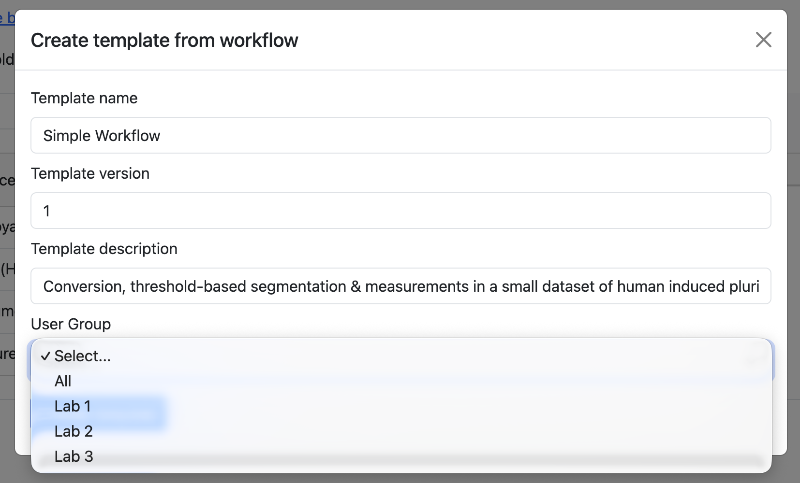
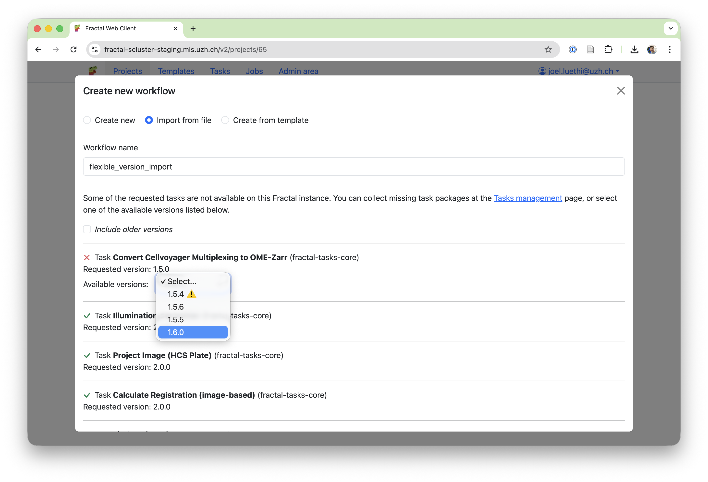
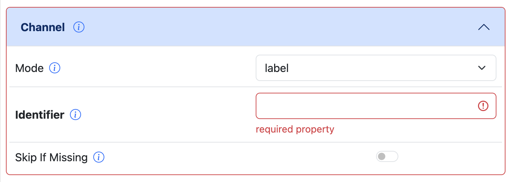

# Fractal Workflow Templates

The [Fractal framework](../index.md), developed at the [BioVisionCenter](https://www.biovisioncenter.uzh.ch/en.html), allows users to build complex image processing workflows and run them on Terabytes of high-dimensional microscopy data. 

Following up on the recent addition of [collaborative features around project sharing](2025-12-17-fractal-project-sharing.md), we want to further strengthen the ways people can share complex processing workflows with each other and make it easier for new researchers to be onboarded to use Fractal. For this purpose, we've added Fractal workflow templates with the 2.20 Fractal server update.

Workflow templates allow users to start from pre-defined workflows where tasks are ordered and pre-configured for specific analysis needs, as well as to define their own templates that they can share with others.

<iframe width="560" height="315" src="https://www.youtube.com/embed/5zhi0f6LX7k?si=WjPv6-c2XSc_RI4y" title="YouTube video player" frameborder="0" allow="accelerometer; autoplay; clipboard-write; encrypted-media; gyroscope; picture-in-picture; web-share" referrerpolicy="strict-origin-when-cross-origin" allowfullscreen></iframe>

Given the [over 100 publicly available Fractal tasks](../fractal_tasks.md), finding useful combinations of tasks that create meaningful workflows has become a challenge for new users. And even for well documented tasks, knowing exactly how to use them, how to tweak their parameters for a given workflow can require some expert knowledge. Workflow templates aim to give Fractal power users, members of core facilities and us in the Fractal core team a better mechanism in how such knowledge can be shared.

By setting up template workflows, this knowledge is distilled into a shareable unit. Experts develop new workflows, add descriptions of how a workflow can be used, and add descriptions to individual tasks on how their parameters should be adapted for specific cases. These workflows can then be shared with collaborators, with all users of a given Fractal server or the broader Fractal community.

On your Fractal server, you can create a new workflow template that is just accessible to yourself, that is shared within a specific user group (e.g. shared with a given lab) or shared with all the users of a Fractal server. When creating new templates, here are a few best practices:

1. Create a **meaningful title** for your template. The title should allow other researchers to understand whether this workflow is meant for their kind of image analysis
2. Write a **short workflow description** that details what this workflow is meant for. You can point to publicly available test data to run this workflow, describe the type of microscopy it's developed for (e.g. 3D image analysis in a high content screening context) or include additional information about what to be careful with when adapting the workflow.
3. Use **task descriptions** to give context on the fine-grained choices. Why did you select one segmentation method over another? Which parameters did you tune? Are there parameters other users should tune when adapting from this template?
4. Are you setting any paths in your template? Consider **removing the paths** from the task arguments, unless they point to example data accessible to all other users you share the template with. This can be paths to input data for converters, settings files (e.g. for registration, classifiers etc.) or correction images (e.g. for illumination correction tasks). The path that your input files have on your Fractal server most likely won't be the path that another user on another cluster will put their input data at.

Ready to share beyond your server? The Fractal community is building a public home for templates too. We host a [public Fractal workflow template hub] here on the Fractal overview page with core templates to be shared with users in the Fractal community. You can download templates from here and add them to your own Fractal server. Or contact us if you have a workflow template that you want to share. We don't have a formalised process for managing publicly shared workflow templates yet and are still evaluating options like adding workflow templates to the [WorkflowHub](https://workflowhub.eu/).

[TBD Screenshot public hub => once splash page hub is available]

How do those templates actually work under-the-hood? They make use of the Fractal workflow definition, which serialises the order of tasks, their version and all task parameters. A workflow template is a thin wrapper around that with some additional metadata like title & description. On top of the template definition, we've added a lot of extra features to the 2.19 & 2.20 Fractal server releases to make workflow templates perform well. Besides the actual templates, you'll also find:

- **Improved workflow import UI:** Workflow imports now handle version mismatches between a template version of a task & the one accessible to you. If the template wants fractal-tasks-core 2.0.0, but you only have 2.0.1 available to you, we can now update the version to be used at import time.

- **Handle changing task parameters:** When updating tasks, the task arguments may also change. We added support for showing old arguments and asking users to input the new arguments now, making task-updating smoother.
- **Refactor task argument validation:** We used to only allow you to save task arguments once they completely validate against the task manifest. Now, we validate the arguments individually and can show you issues in your arguments more specifically. Instead of failing to save your inputs, we just validate for correct arguments before workflow submission. This gives you flexibility in template creation (e.g. leaving away required paths so users fill them in) and improves the task parameter setting UI.

Let's build more workflow templates together and empower more researchers to build complex image analysis workflows for themselves!
