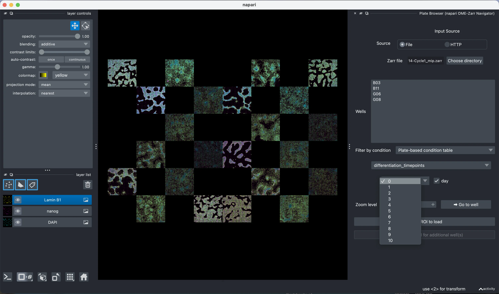
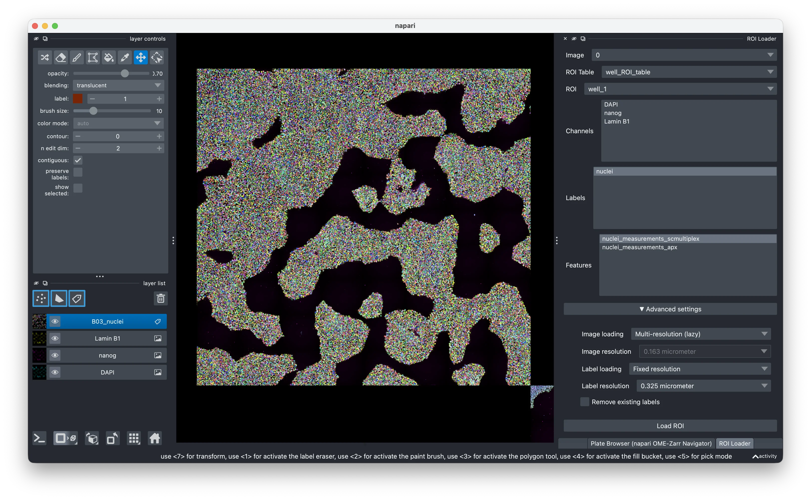
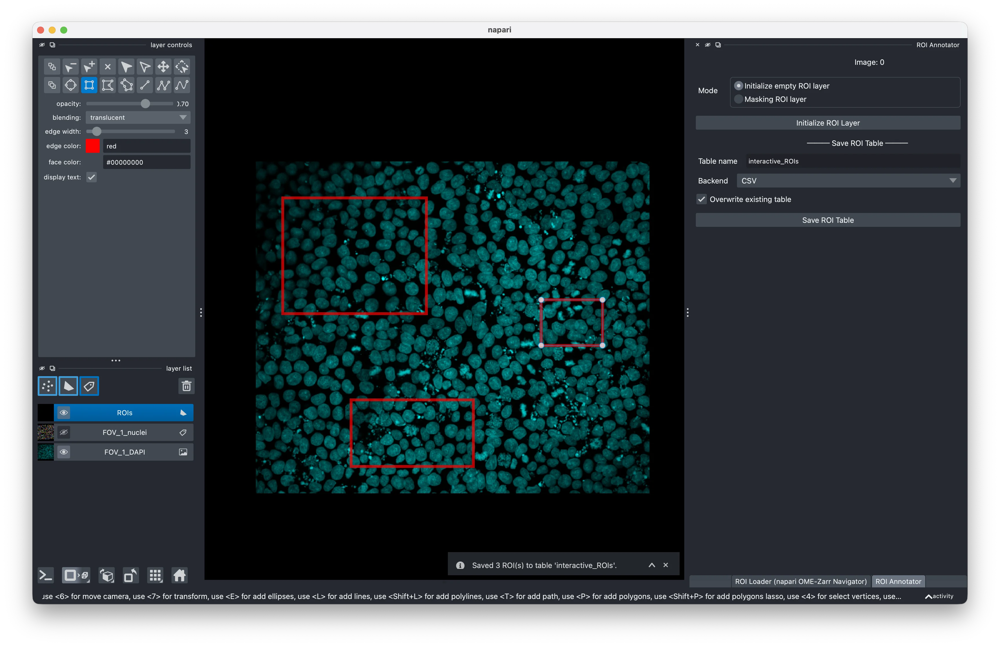
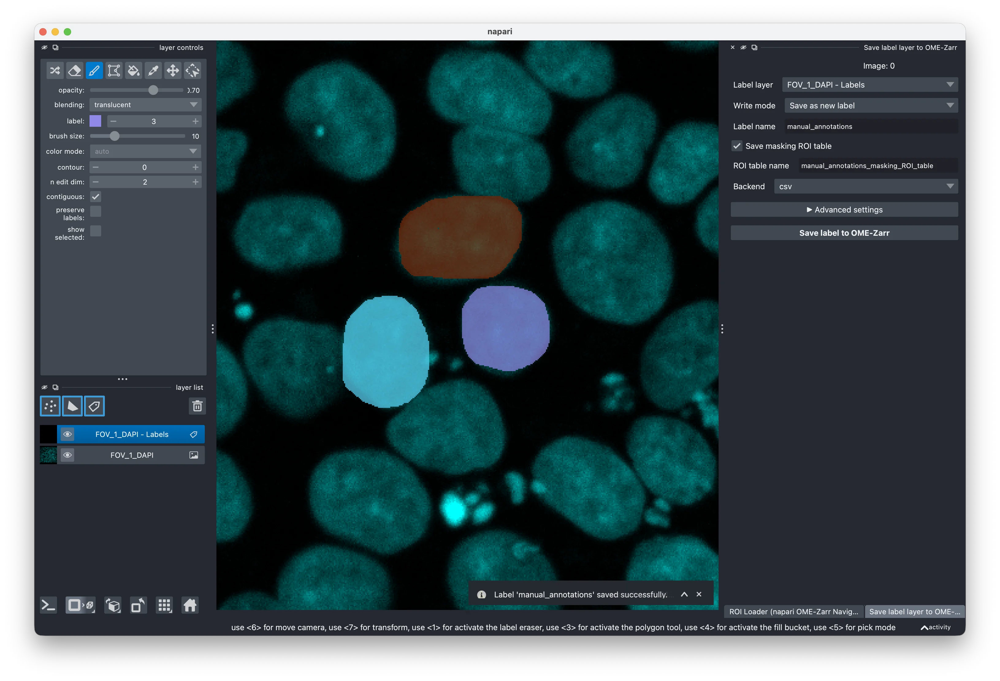
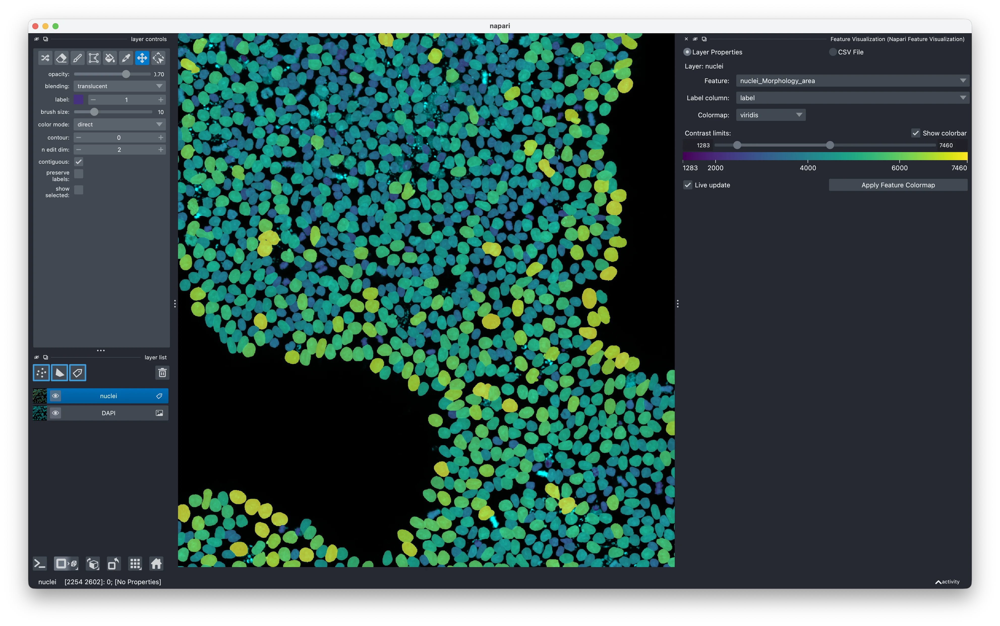
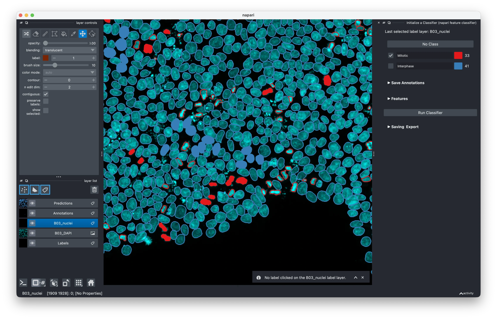

# napari plugins to handle Fractal-created OME-Zarrs

The [Fractal platform](../index.md) enables running complex image analysis workflows that enrich OME-Zarrs with label images, [ROI tables](https://biovisioncenter.github.io/ngio/stable/table_specs/table_types/roi_table/), [condition tables](https://biovisioncenter.github.io/ngio/stable/table_specs/table_types/condition_table/) and [feature tables](https://biovisioncenter.github.io/ngio/stable/table_specs/table_types/feature_table/). This makes for very rich, portable OME-Zarr containers that contain image data, segmentation and quantification results. These rich data containers can be consumed by different tools for visualization, quality control & downstream analysis. 

In this post, we will cover updates to the Fractal napari plugins that allow users to interact with condition tables, load images standalone or from HCS plates, interactively annotate new ROI tables, proof-read label images and write them back into OME-Zarr, as well as integrate with feature visualization and interactive classifier training. We have refactored this and the other napari plugins in the fractal-napari-plugins-collection in recent months to broaden their functionality, improve the user experience and increase the plugin stability.

The main entry point is the [napari-ome-zarr-navigator plugin](https://github.com/fractal-napari-plugins-collection/napari-ome-zarr-navigator). It handles the more complex interactions of loading different table types (like condition tables, ROI tables & feature tables) from the OME-Zarr using the [ngio library](https://github.com/BioVisionCenter/ngio). As such, it makes complex OME-Zarr containers accessible from a no-code napari plugin. The plugin consists of different widgets for distinct functionalities, all linked to offer an integrated user experience.

<iframe width="560" height="315" src="https://www.youtube.com/embed/aUlbiQJXx_I" title="YouTube video player" frameborder="0" allow="accelerometer; autoplay; clipboard-write; encrypted-media; gyroscope; picture-in-picture; web-share" referrerpolicy="strict-origin-when-cross-origin" allowfullscreen></iframe>

## Plate Browser

The first widget, the "Plate Browser", is useful for users with [high content screening plates](https://ngff.openmicroscopy.org/specifications/0.5/index.html#high-content-screening). It allows browsing the list of available wells in a plate. If the plate is loaded lazily using the napari-ome-zarr plugin, the image data is already viewable & the plugin auto-detects the plate location on disk. It allows filtering wells by a condition table (now with support for both plate-level condition tables and per-image condition tables) and then launching other widgets like the ROI Loader or the ROI Annotator for a given well.



## ROI Loader

Using the ROI Loader widget, you can load images, labels and feature tables from an OME-Zarr. You can load either the whole image/label or just the subset that refers to a given spatial region. It allows for lazy-loading pyramidal images/labels, but also loading them at a single fixed resolution directly into memory (better for 3D visualisations and interoperability with some downstream plugins). Feature tables get added to the label_layer.features property, where they are accessible to other napari plugins.



## ROI Annotator

If you want to have custom regions of interest available in your image, you can use the ROI Annotator widget to draw them in a shape layer and then have them saved back into your OME-Zarr as a [ROI table](https://biovisioncenter.github.io/ngio/stable/table_specs/table_types/roi_table/). The napari shape layers only allow annotation in 2D, thus this widget doesn't support drawing 3D ROIs (2D ROIs in a 3D volume are supported though). An additional feature that partially works around this limitation is the calculation of [masking ROI tables](https://biovisioncenter.github.io/ngio/stable/table_specs/table_types/masking_roi_table/). Based on an existing or user-created label layer, we calculate the bounding boxes around all objects and save them as ROIs. If the label layer exists in the OME-Zarr, a masking ROI table is saved. If it does not exist in the OME-Zarr, a regular ROI table is written instead. While we can't visualise the ROI in 3D, we keep metadata about the Z extent to write a full 3D ROI table.



## Save Label Layer to OME-Zarr

If you created new labels in napari or proof-read existing labels, you can use the new Save Label Layer to OME-Zarr widget to write them back to your OME-Zarr. This is particularly helpful for label proof-reading thanks to the nuanced writing modes: You can save the label layer as a new label, or you can edit an existing label layer. If you work on a subset of the image loaded via the ROI loader (or correctly set scales & translations of the layer yourself), editing existing labels will only overwrite the labels in the area of your label layer and leave areas beyond it as they were (very helpful when you e.g. proof-read huge 3D segmentations, one area at a time).



## Plugin integrations

The integrations of loading label layers and feature layers into napari also enable powerful interactions with downstream plugins. For example, features loaded through the ROI Loader together with a label layer can then be used by the [napari-feature-visualization plugin](https://github.com/fractal-napari-plugins-collection/napari-feature-visualization) to color label layers by their features and thus spatially visualize the measurements.



Additionally, the [napari-feature-classifier plugin](https://github.com/fractal-napari-plugins-collection/napari-feature-classifier) can make use of those embedded features to train interactive classifiers based on annotations, linking the visualisation of the image data, the objects detected in the label image and the quantification available in the feature tables to create cell type classification, quality control detection, mitotic cell classification and other user-defined classifications.



## Installation

You can install the navigator plugin via pypi into existing napari environments (`pip install napari-ome-zarr-navigator`) or, to ensure you have a clean environment with the other plugins mentioned above, you can use the pixi config we ship with the plugin:

```bash
git clone https://github.com/fractal-napari-plugins-collection/napari-ome-zarr-navigator
cd napari-ome-zarr-navigator
pixi run --frozen napari-fractal
```

## Outlook

In summary, the napari-ome-zarr-navigator plugin offers integrations of OME-Zarr features into napari workflows and allows you to visualise complex OME-Zarrs, perform interactive annotations, feature explorations or even interactive classifier training (by integrating with the napari-feature-classifier & napari-feature-visualization plugins).

Given that the enriched OME-Zarr container is a well-specified object with clear metadata, it can be used interoperably in different contexts: One can create it using Fractal tasks either through the Fractal framework or by running them standalone, use the napari plugins to update their content, and go back into a Fractal workflow. Alternatively, one can use the [fractal-feature-explorer](https://github.com/fractal-analytics-platform/fractal-feature-explorer) to perform interactive quality control or write custom scripts or notebooks for downstream data analysis.
