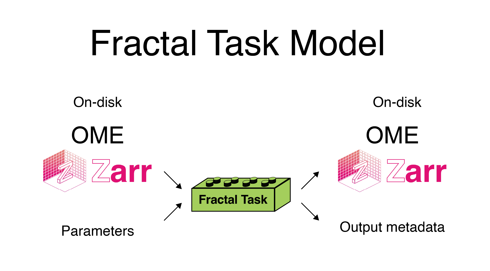

# Tasks

Fractal tasks are modular and interoperable processing units that handle data in OME-Zarr containers. Each task is an executable that runs on a single OME-Zarr image or a collection of OME-Zarr images. In Fractal, we the OME-Zarrs to be processed by giving the tasks the zarr_urls(s), the paths to a given OME-Zarr image on disk or in the cloud. All tasks load data from an OME-Zarr on disk and store their processing results in an OME-Zarr (the same or a new one) on disk again. The parameters and metadata of tasks are described in a [Fractal manifest in json form](#task-list-and-manifest). This page contains an overview of the Fractal task specification, the [types of Fractal tasks](#task-types), the [manifest](#task-list-and-manifest) that specifies task metadata as well as their [input](#input-api) & [output](#output-api) API.



## Task Types

There are three types of tasks in Fractal V2: parallel tasks, non-parallel tasks & compound tasks.

1. A **parallel task** is written to process a single OME-Zarr image and meant to be run in parallel across many OME-Zarr images. 
	- Parallel tasks are the typical scenario for compute tasks that don't need special input handling or subset parallelization. 
	- Parallel tasks can typically be run on any collection of OME-Zarrs.
2. A **non-parallel task** processes a list of images, and it only runs as a single job. 
	- Non-parallel tasks are useful to aggregate information across many OME-Zarrs or to create image-list updates (see [the Fractal image list](./image_list.md)).
	- Non-parallel tasks can often be specific to given collection types like OME-Zarr HCS plates.
3. A **compound task** consists of an *initialization* (non-parallel) task and a (parallel) *compute* task.
	- The initialization task runs in the same way as a non-parallel task and generates a custom parallelization list of zarr_urls & parameters to be used in the compute task.
	- The compute tasks are run in parallel for each entry of the parallelization list and use the `init_args` dictionary as an extra input from the initialization task.
	- Compound tasks can often be specific to given collection types like OME-Zarr HCS plates. A typical example are multiplexing-related tasks that use `acquisition` metadata on the well level to decide which pairs of images need to be processed.


## Task list and manifest

A package that provides Fractal tasks must contain a manifest (stored as a `__FRACTAL_MANIFEST__.json` file within the package), that describes the parameters, executables and metadata of the tasks. `fractal-tasks-core` and `fractal-tasks-template` offer a simplified way to generate this manifest, based on a task list written in Python. 

### Task list
If the task package `my-pkg` was created based on the template, the task list is in `src/my-pkg/dev/task_list.py` and includes entries like
```python
TASK_LIST = [
	NonParallelTask(
    	name="My non-parallel task",
    	executable="my_non_parallel_task.py",
    	meta={"cpus_per_task": 1, "mem": 4000},
		category="Conversion",
		docs_info="file:task_info/task_description.md",
		tags=["tag1", "Microscope name"]
	),
	ParallelTask(
    	name="My parallel task",
    	executable="my_parallel_task.py",
    	meta={"cpus_per_task": 1, "mem": 4000},
		category="Segmentation",
	),
	CompoundTask(
    	name="My compound task",
    	executable_init="my_task_init.py",
    	executable="my_actual_task.py",
    	meta_init={"cpus_per_task": 1, "mem": 4000},
    	meta={"cpus_per_task": 2, "mem": 12000},
		category="Registration",
	),
]
```
where the different task models refer to the [different task types](#task-types). Given such task list, running the following command
```bash
python src/my-pkg/dev/create_manifest.py
```
generates a JSON file with the up-to-date manifest. Note that advanced usage may require minor customizations of the create-manifest script.

### Manifest metadata
The task manifest can contain additional metadata that makes it easier for people to browse tasks on the [Fractal task page](#./fractal_tasks.md) and the tasks available on a given server. The [Fractal task template](https://github.com/fractal-analytics-platform/fractal-tasks-template) provides good defaults for how all this metadata can be set. This metadata is also used to make tasks searchable.

#### Docs info
Tasks can provide a structured summary of their functionality. If the image list does not contain a docs_info property for a given task, the docstring of the task function is used. A developer can provide a more structured markdown file by specifying the relative path to the markdown file with the task description (for example: `file:task_info/task_description.md`). The convention for these task descriptions is to contain a section on the purpose of the task as well as its limitations in a bullet-point list.

#### Categories
Tasks can belong to a single category, which allows users to filter for the kind of task they are looking for. The standard categories are: `Conversion`, `Image Processing`, `Segmentation`, `Registration`, `Measurement`.

#### Modalities
Tasks can have a single modality metadata. If a task works on all types of OME-Zarrs, no modality should be set. If a task is specifically designed to work on one modality (for example, a task that required OME-Zarr HCS plates), the modality should be specified. The standard modalities are: `HCS`, `lightsheet`, `EM`.

#### Tags
Tasks can have arbitrary lists of string tags that describe their functionality. These are particularly helpful to increase the findability of a task using search.

#### Authors
Task packages can specify an authors list. This metadata is configured in the create_manifest.py script for the whole task package.

### How to get your task package on the Fractal tasks page
If you have a task package that you would like to see listed on the [Fractal task page](#./fractal_tasks.md) page, ping one of the Fractal maintainers about it or [make a PR to have your task included in the list of task sources here](https://github.com/fractal-analytics-platform/fractal-analytics-platform.github.io/blob/main/tasks_data_retrieval/sources.txt). For a task package to be listable on the Fractal tasks page, the package needs to contain a Fractal manifest and be available either via PyPI or via a whl in Github releases. The [Fractal task template](https://github.com/fractal-analytics-platform/fractal-tasks-template) provides examples for how to do both.
Future work will add support for adding additional task configurations (likely a specification for how to provide packages that are installable via Pixi).


## Input API

### Parallel tasks

The input arguments of a Fractal parallel tasks must include a `zarr_url` string argument. The `zarr_url` contains the full path to the zarr file to be processed. Only filesystem paths are currently supported, not S3 urls.
`zarr_url` is a reserved keyword argument: when running tasks through Fractal server, the server takes care to pass the correct `zarr_url` argument to the parallel task (based on filtering the image list).
Tasks can also take an arbitrary list of additional arguments that are specific to the task function and that the user can set.

### Non-parallel tasks

The input arguments of a Fractal non-parallel task must include a `zarr_urls` arguments (a list of strings) and `zarr_dir` argument (a single string). `zarr_urls` contains the full paths to the OME-Zarr images to be processed. We currently just support paths on filesystems, not S3 urls. `zarr_dir` is typically the base directory into which OME-Zarr files will be written by tasks and it is mostly used by converters.
Both `zarr_urls` and `zarr_dir` are reserved keyword arguments: when running tasks through Fractal server, the server takes care to pass the correct filtered list `zarr_urls` and the correct `zarr_dir` to the non-parallel task.
Tasks can also take an arbitrary list of additional arguments that are specific to the task function and that the user can set.

### Compound tasks

Compound tasks consist of an init part (similar to the non-parallel task) and a compute part (similar to the parallel task).
The init part has the same Input API as the non-parallel task (`zarr_urls` and `zarr_dir`), but it provides the parallelization list for the compute part as an output.
The compute part takes the `zarr_url` argument and an extra `init_args` dictionary argument (which is coming from the `parallelization_list` provided by the init task).

## Output API

Tasks can optionally return updates to the image list and/or [new dataset filters](./image_list.md#dataset-filters) (this is true for all tasks except the init phase of a compound tasks) or a parallelization list (just the init phase of a compound task). The output of a task is always a `task_output` dictionary. Note that this dictionary must be JSON-serializable, since it will be written to disk so that `fractal-server` can access it.

For tasks that create new images or edit relevant image properties, `task_output` must include an `image_list_updates` property so the server can update its metadata about that image.

> NOTE: if new filters are set, but both `image_list_updates` and `image_list_removals` are empty, in the task output, then `fractal-server` includes all the filtered image list in `image_list_updates`, so that they are updated with the appropriate `types` (see also [the image-list page](./image_list.md#image-types)).

Task outputs with image list updates are returned as a dictionary that contains the `image_list_updates` key and a list containing the updates to individual images. The updates need to be for unique `zarr_url`s and each update needs to contain the `zarr_url` of the image it’s providing an update for. Additionally, they can provide an `origin` key, an `attributes` key and a `types` key. The `origin` key describes the `zarr_url` of another image already in the image list and will take the existing attributes and types from that image. Attributes and types can also be directly set by a task.

Here's an example of `task_output`:
```python
{
	"image_list_updates" = [
		{
			"zarr_url": "/path/to/my_zarr.zarr/B/03/0_processed",
			"origin": "/path/to/origin_zarr.zarr/B/03/0",
			"attributes": {
				"plate": "plate_name",
				"well": "B03"
			},
			"types": {
				"is_3D": True
			}
		}
	]
}
```

Here is an example of a task that provides new filter updates without changing the image list. This task sets the `is_3D` filter to True:
```python
{
	"filters" ={
		"types": {
			"is_3D": True
		}
	}
}
```

The init part of a compound task must produe a parallelization lists, with elements having the `zarr_url` property as well as additional arbitrary arguments as an `init_args` dictionary.
Parallelization lists are provided in the following structure:
```python
{
    "parallelization_list": [
        {
            "zarr_url": "/path/to/my_zarr.zarr/B/03/0",
            "init_args": {"some_arg": "some_value"},
        }
    ]
}
```

