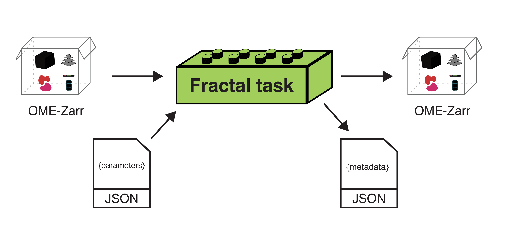

# Fractal Tasks Specification

Fractal tasks are modular and interoperable processing units that handle data in OME-Zarr containers. Each task is an executable that runs on a single OME-Zarr image or a collection of OME-Zarr images.
In Fractal, we determine the OME-Zarrs to be processed by giving the tasks the zarr_urls(s), that is, the paths to a given OME-Zarr image on disk or in the cloud.
All tasks load data from an OME-Zarr on disk (with the exception of tasks that convert raw microscope data into OME-Zarr images) and store their processing results in an OME-Zarr (the same or a new one) on disk again.
The parameters and metadata of tasks are described in a [Fractal manifest in JSON form](#task-list-and-manifest). This page contains an overview of the Fractal task specification, the [types of Fractal tasks](#task-types), the [manifest](#task-list-and-manifest) that specifies task metadata as well as their [parameters](#task-parameters) & [output metadata](#output-metadata).



## Task Types

There are five types of Fractal tasks:
1. _parallel_ tasks,
2. _non-parallel_ tasks,
3. _compound_ tasks,
4. _compound converter_ tasks,
4. _non-parallel converter_ tasks.

The detailed description of each task type (including required task parameters) is available at https://fractal-analytics-platform.github.io/fractal-task-tools/usage/task_types.


## Task list and manifest

A package that provides Fractal tasks must contain a manifest (stored as a `__FRACTAL_MANIFEST__.json` file within the package), that describes the parameters, executables and metadata of the tasks. The `fractal-task-tools` project offers a simplified way to generate the manifest, based on a task list written in Python - see [specific documentation](https://fractal-analytics-platform.github.io/fractal-task-tools/usage/manifest/).


### Manifest/task metadata

The task manifest can contain additional metadata that makes it easier for people to browse the tasks on the [Fractal task page](./fractal_tasks.md) and the tasks available on a given server. The [Fractal task template](https://github.com/fractal-analytics-platform/fractal-tasks-template) provides good defaults for how all this metadata can be set. This metadata is also used to make tasks searchable.

#### Docs info

Tasks can provide a structured summary of their functionality. If the task list does not contain a `docs_info` property for a given task, the docstring of the task function is used. A developer can provide a more structured markdown file by specifying the relative path to the file with the task description (for example: `file:task_info/task_description.md`). The convention for these task descriptions is to contain a section on the purpose of the task as well as its limitations in a bullet-point list.

#### Categories

Tasks can belong to a single category, which allows users to filter for the kind of task they are looking for. The standard categories are: `Conversion`, `Image Processing`, `Segmentation`, `Registration`, `Measurement`.

#### Modalities

Tasks can have a single modality metadata. If a task works on all types of OME-Zarrs, no modality should be set. If a task is specifically designed to work on one modality (for example, a task that required OME-Zarr HCS plates), the modality should be specified. The standard modalities are: `HCS`, `lightsheet`, `EM`.

#### Tags

Tasks can have arbitrary lists of string tags that describe their functionality. These are particularly helpful to increase the findability of a task using search.

#### Authors

Task packages can specify an authors list.

### How to get your task package on the Fractal tasks page

If you have a task package that you would like to see listed on the [Fractal task page](./fractal_tasks.md) page, ping one of the Fractal maintainers about it or [make a PR to have your task included in the list of task sources here](https://github.com/fractal-analytics-platform/fractal-analytics-platform.github.io/blob/main/tasks_data_retrieval/sources.txt). For a task package to be listable on the Fractal tasks page, the package needs to contain a Fractal manifest and be available either via PyPI or as a wheel file in a Github release. The [Fractal task template](https://github.com/fractal-analytics-platform/fractal-tasks-template) provides examples for how to do both.
Future work will add support for adding additional task configurations (likely a specification for how to provide packages that are installable via [`pixi`](https://pixi.sh)).


## Output metadata

Tasks can optionally return updates to the image list (this is true for all tasks except the init phase of a compound tasks) or a parallelization list (just the init phase of a compound task). The output of a task is always a `task_output` dictionary. Note that this dictionary must be JSON-serializable, since it will be written to disk so that `fractal-server` can access it.

For tasks that create new images or edit relevant image properties, `task_output` must include an `image_list_updates` property so the server can update its metadata about that image.

> NOTE: if both `image_list_updates` and `image_list_removals` are empty in the task output, then `fractal-server` includes all the filtered image list into `image_list_updates`, so that they are updated with the appropriate `types` (see also [the image-list page](./image_list.md#image-types)).

Task outputs with image list updates are returned as a dictionary that contains the `image_list_updates` key and a list containing the updates to individual images. The updates need to be for unique `zarr_url`s and each update needs to contain the `zarr_url` of the image it’s providing an update for. Additionally, they can provide an `origin` key, an `attributes` key and a `types` key. The `origin` key describes the `zarr_url` of another image already in the image list and will take the existing attributes and types from that image. Attributes and types can also be directly set by a task.

Here's an example of `task_output`:
```python
{
	"image_list_updates" = [
		{
			"zarr_url": "/path/to/my_zarr.zarr/B/03/0_processed",
			"origin": "/path/to/origin_zarr.zarr/B/03/0",
			"attributes": {
				"plate": "plate_name",
				"well": "B03"
			},
			"types": {
				"is_3D": True
			}
		}
	]
}
```

The init part of a compound task must produe a parallelization lists, with elements having the `zarr_url` property as well as additional arbitrary arguments as an `init_args` dictionary.
Parallelization lists are provided in the following structure:
```python
{
    "parallelization_list": [
        {
            "zarr_url": "/path/to/my_zarr.zarr/B/03/0",
            "init_args": {"some_arg": "some_value"},
        }
    ]
}
```

