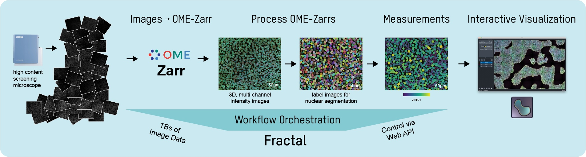

Fractal is a framework to process high-content imaging data at scale and prepare it for interactive visualization.

Fractal provides distributed workflows that convert TBs of image data into [OME-Zarr](https://ngff.openmicroscopy.org) files. The platform then processes the 3D image data by applying tasks like illumination correction, maximum intensity projection, 3D segmentation using [cellpose](https://cellpose.readthedocs.io/en/latest/) and measurements using [napari workflows](https://github.com/haesleinhuepf/napari-workflows). The pyramidal OME-Zarr files enable interactive visualization in the napari viewer.

OME-Zarr files can be interactively visualizated in napari. Here is an example using the newly-proposed async loading in [NAP4](https://github.com/napari/napari/pull/4905) and a dev version of the [napari-ome-zarr plugin](https://github.com/ome/napari-ome-zarr):



 
  
# Fractal components

Fractal is made of different components, including a server/client architecture and a set of core tasks for image processing.

|  **Component** 	|                                  **GitHub Repository**                                 	|                                      **Documentation**                                     	|                                **Package**                                	|
|:--------------:	|:--------------------------------------------------------------------------------------:	|:------------------------------------------------------------------------------------------:	|:-------------------------------------------------------------------------:	|
|   **server**   	|     [fractal-server](https://github.com/fractal-analytics-platform/fractal-server)     	|     [fractal-server docs](https://fractal-analytics-platform.github.io/fractal-server)     	|     [fractal-server on PyPI](https://pypi.org/project/fractal-server)     	|
|   **client**   	|            [fractal](https://github.com/fractal-analytics-platform/fractal)            	|       [fractal docs](https://fractal-analytics-platform.github.io/fractal)                  	|     [fractal-client on PyPI](https://pypi.org/project/fractal-client)     	|
|   **common**   	|     [fractal-common](https://github.com/fractal-analytics-platform/fractal-common)     	|                                              -                                             	|                                     -                                     	|
| **core tasks** 	| [fractal-tasks-core](https://github.com/fractal-analytics-platform/fractal-tasks-core) 	| [fractal-tasks-core docs](https://fractal-analytics-platform.github.io/fractal-tasks-core) 	| [fractal-tasks-core on PyPI](https://pypi.org/project/fractal-tasks-core) 	|

# Status

Fractal is under active development. We have the core processing functionality working for Yokogawa CV7000 image data and a series of workflows for processing OME-Zarr images from illumination correction to feature measurements. We are still adding core functionality and will introduce breaking changes to improve task flexibility and expand the collection of tasks. Follow along on the github repositories above.

# How to Get Started
Fractal runs on a laptop (tested both on Linux & macOS) or on server that submits jobs to a SLURM cluster. The documentation above describes the preconditions and the different configurations that can be changed. To get started with Fractal, you can follow the setup in the [fractal-demos repository](https://github.com/fractal-analytics-platform/fractal-demos).
Follow the [instructions here](https://github.com/fractal-analytics-platform/fractal-demos/tree/main/examples/server) on how to install the fractal-server.  

Once you have successfully installed and started the Fractal server, you can install a fractal-client environment and interact with the Fractal server from there. To do so, follow the [instructions for the 01_cardio_tiny_dataset example](https://github.com/fractal-analytics-platform/fractal-demos/tree/main/examples/01_cardio_tiny_dataset). This also includes a link to a tiny dataset and instructions on how to run a full Fractal workflow on this dataset (which should run in under a minute).

# Examples

Additional example datasets and workflows are publicly available:
* Larger example input data for Fractal can be found here: [10.5281/zenodo.7057076](https://doi.org/10.5281/zenodo.7057076).
* Example output data from Fractal in the OME-Zarr format can be found here: [10.5281/zenodo.7081622](https://doi.org/10.5281/zenodo.7081622).
* Additional example workflows can be found in the [fractal-demos repository](https://github.com/fractal-analytics-platform/fractal-demos) in the `examples` folder. `08_cardio_2x2_napari_workflows` contains a workflow to produce the example output using the example input. Other examples contain different workflows for data that has not been made public so far.

# Contributors and license

Unless otherwise stated in each individual module, all Fractal components are released according to a BSD 3-Clause License, and Copyright is with Friedrich Miescher Institute for Biomedical Research and University of Zurich.

Fractal was conceived in the Liberali Lab at the Friedrich Miescher Institute for Biomedical Research and in the Pelkmans Lab at the University of Zurich (both in Switzerland). The project lead is with [@gusqgm](https://github.com/gusqgm) & [@jluethi](https://github.com/jluethi). The core development is done under contract by [@mfranzon](https://github.com/mfranzon), [@tcompa](https://github.com/tcompa) & [jacopo-exact](https://github.com/jacopo-exact) from [eXact lab S.r.l.](https://www.exact-lab.it).
